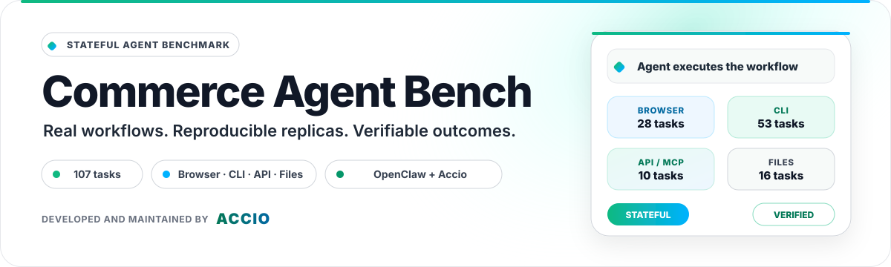
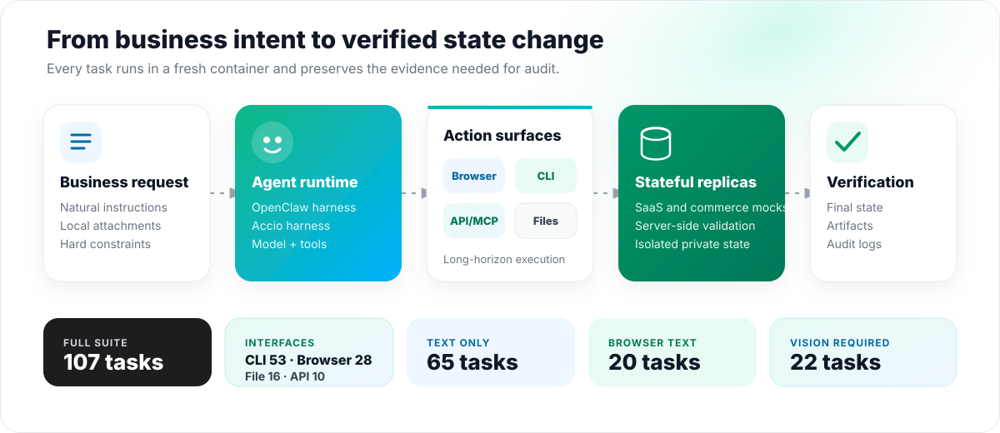
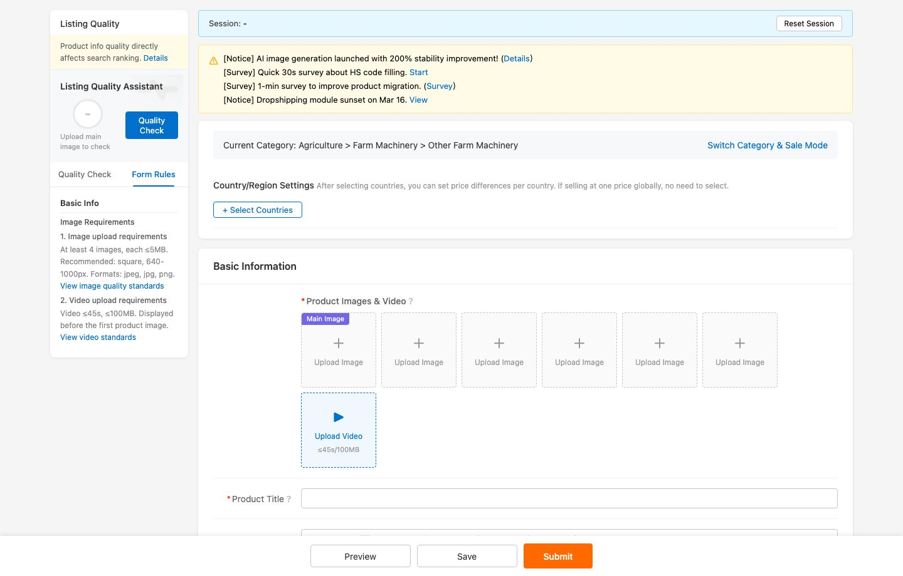
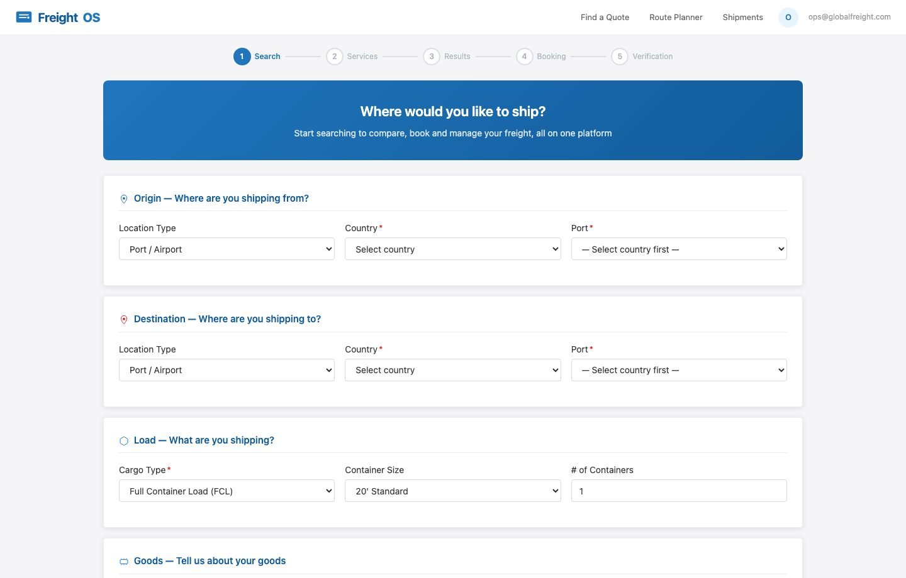
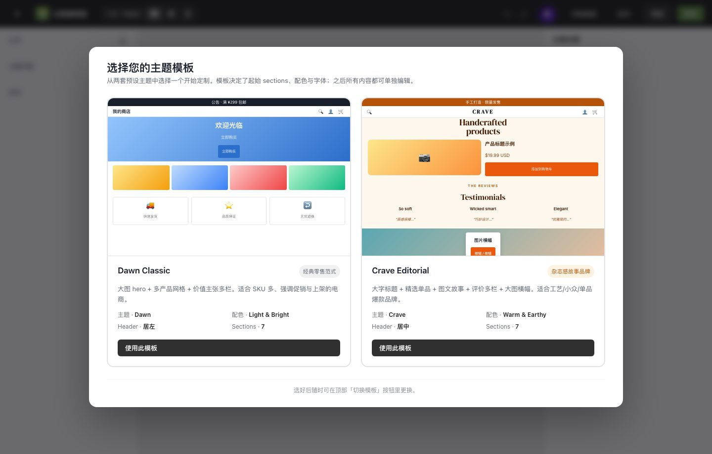
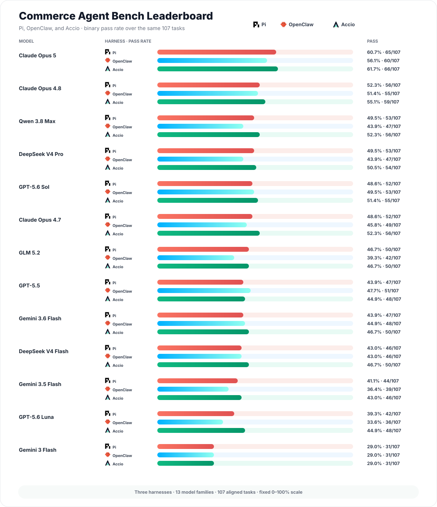

<p align="center">
  
</p>

<p align="center">
  <a href="https://www.accio.com/">
    
  </a>
</p>

<p align="center">
  <strong>Developed and maintained by the Accio team at Alibaba International.</strong>
</p>

<p align="center">
  <a href="#reproducibility-contract"></a>
  <a href="#task-and-run-layout"></a>
  <a href="#quick-start"></a>
  <a href="#quick-start"></a>
  <a href="#reference-results"></a>
</p>

<p align="center">
  <a href="#overview">Overview</a> ·
  <a href="https://commerce-agent-bench.site.accio.ai/">Live leaderboard</a> ·
  <a href="https://commerce-agent-bench-mock-showcase.site.accio.ai/">Mock showcase</a> ·
  <a href="#quick-start">Quick start</a> ·
  <a href="#reproducibility-contract">Reproducibility</a> ·
  <a href="#get-your-model-evaluated-or-work-with-us">Contact</a>
</p>

<p align="center">
  <a href="#get-your-model-evaluated-or-work-with-us">
    
  </a>
  &nbsp;
  <a href="#get-your-model-evaluated-or-work-with-us">
    
  </a>
</p>

<p align="center">
  <sub>We run models on request, including pre-release and internal builds —
  and we are open to working together on the benchmark.</sub>
</p>

<p align="center">
  <sub>Also from the Accio team:
  <a href="https://github.com/Accio-org/BusinessArena"><strong>Business Arena</strong></a>
  — can an agent run a seller business over a 30-day market horizon?</sub>
</p>

---

## Overview

Commerce Agent Bench evaluates whether an agent can complete long-horizon business
workflows, not just answer questions about them. Tasks cover browser operations,
native-style CLI tools, API/MCP workflows, document and spreadsheet production,
public-web research, supplier analysis, product publishing, logistics, and
commerce operations. Every task runs in a fresh container and is graded by its
own deterministic or LLM-assisted verifier.

> **Note on naming.** This project was previously known as
> **RealReplicaBench**. It was renamed **Commerce Agent Bench** to better reflect
> its intended scope and support future expansion.

- **107 tasks:** 53 CLI, 28 browser, 16 file, and 10 API/MCP tasks.
- **Three capability slices:** 65 text-only, 20 browser-text-capable, and 22
  vision-required tasks.
- **Stateful evaluation:** local mock services model SaaS, commerce, messaging,
  document, and operational systems without requiring production accounts.
- **Auditable outputs:** each run preserves the resolved configuration,
  trajectory, verifier result, artifacts, logs, and container metadata.

<p align="center">
  
</p>

### Real task surfaces

The suite uses reproducible local replicas of commerce and business software,
so agents must operate interfaces and change state.

<table>
  <tr>
    <td width="33%"></td>
    <td width="33%"></td>
    <td width="33%"></td>
  </tr>
  <tr>
    <td align="center"><strong>Product publishing</strong><br><sub>Structured catalog and listing operations</sub></td>
    <td align="center"><strong>Freight booking</strong><br><sub>Multi-step logistics workflows</sub></td>
    <td align="center"><strong>Storefront operations</strong><br><sub>Visual configuration and stateful editing</sub></td>
  </tr>
</table>

<p align="center">
  <a href="https://commerce-agent-bench-mock-showcase.site.accio.ai/">
    
  </a>
</p>

<p align="center">
  <sub>Browse 104 rendered pages across eight UI mock services. The showcase is
  a static visual tour; state-changing interactions run inside the benchmark
  runtime.</sub>
</p>

## Reference results

Results are aligned by `task_id` over the complete 107-task collection. The
tables below are per harness — thirteen model families on each, with the same
thirteen in all three, so every row compares directly across the Pi, OpenClaw and Accio tables.
The published scores were produced through Accio-managed evaluation endpoints
with `gemini-3.1-pro-preview` as the judge; the public path in this repository
uses bring-your-own credentials. Every model ran with thinking enabled at its
provider's default reasoning effort; that default differs by vendor, so the
harness tier does too.

The [live leaderboard](https://commerce-agent-bench.site.accio.ai/) is the
source of record; the tables below are a snapshot.

<p align="center">
  
</p>

### Detailed evaluation statistics

Pass uses the same verifier semantics across harnesses. Steps, time, and tokens
are descriptive telemetry: tool granularity, runtime scheduling, and provider
usage accounting differ, so these values are not normalized efficiency scores.

🥇🥈🥉 mark the top three within each harness. The bar in the Pass column is
drawn on a fixed 0–100% scale, not normalized to the leader, so bar lengths
are directly comparable between the three tables.

#### Pi

| Model | Pass | Avg. steps | Avg. time | Avg. tokens |
|---|:--|---:|---:|---:|
| 🥇 Claude Opus 5 | `████████████░░░░░░░░` 65/107 (60.7%) | 52.5 | 7.8 min | 2.05M |
| 🥈 Claude Opus 4.8 | `██████████░░░░░░░░░░` 56/107 (52.3%) | 49.1 | 8.7 min | 1.85M |
| 🥉 Qwen 3.8 Max | `██████████░░░░░░░░░░` 53/107 (49.5%) | 52.6 | 13.9 min | 1.79M |
| DeepSeek V4 Pro | `██████████░░░░░░░░░░` 53/107 (49.5%) | 79.7 | 10.6 min | 3.58M |
| GPT-5.6 Sol | `██████████░░░░░░░░░░` 52/107 (48.6%) | 45.4 | 5.4 min | 1.15M |
| Claude Opus 4.7 | `██████████░░░░░░░░░░` 52/107 (48.6%) | 50.5 | 6.9 min | 2.14M |
| GLM 5.2 | `█████████░░░░░░░░░░░` 50/107 (46.7%) | 58.2 | 15.9 min | 2.16M |
| GPT-5.5 | `█████████░░░░░░░░░░░` 47/107 (43.9%) | 47.1 | 7.0 min | 1.47M |
| Gemini 3.6 Flash | `█████████░░░░░░░░░░░` 47/107 (43.9%) | 48.9 | 8.9 min | 2.16M |
| DeepSeek V4 Flash | `█████████░░░░░░░░░░░` 46/107 (43.0%) | 79.1 | 6.3 min | 3.39M |
| Gemini 3.5 Flash | `████████░░░░░░░░░░░░` 44/107 (41.1%) | 69.5 | 13.5 min | 3.13M |
| GPT-5.6 Luna | `████████░░░░░░░░░░░░` 42/107 (39.3%) | 40.4 | 4.7 min | 0.80M |
| Gemini 3 Flash | `██████░░░░░░░░░░░░░░` 31/107 (29.0%) | 56.8 | 8.3 min | 2.43M |

#### OpenClaw

| Model | Pass | Avg. steps | Avg. time | Avg. tokens |
|---|:--|---:|---:|---:|
| 🥇 Claude Opus 5 | `███████████░░░░░░░░░` 60/107 (56.1%) | 47.7 | 12.7 min | 3.47M |
| 🥈 Claude Opus 4.8 | `██████████░░░░░░░░░░` 55/107 (51.4%) | 47.6 | 16.4 min | 4.05M |
| 🥉 GPT-5.6 Sol | `██████████░░░░░░░░░░` 53/107 (49.5%) | 28.6 | 14.4 min | 2.09M |
| GPT-5.5 | `██████████░░░░░░░░░░` 51/107 (47.7%) | 37.1 | 12.7 min | 2.85M |
| Claude Opus 4.7 | `█████████░░░░░░░░░░░` 49/107 (45.8%) | 47.4 | 14.3 min | 4.10M |
| Gemini 3.6 Flash | `█████████░░░░░░░░░░░` 48/107 (44.9%) | 46.3 | 13.5 min | 3.28M |
| Qwen 3.8 Max | `█████████░░░░░░░░░░░` 47/107 (43.9%) | 47.0 | 15.0 min | 2.18M |
| DeepSeek V4 Pro | `█████████░░░░░░░░░░░` 47/107 (43.9%) | 71.9 | 22.3 min | 3.22M |
| DeepSeek V4 Flash | `█████████░░░░░░░░░░░` 46/107 (43.0%) | 137.8 | 19.2 min | 11.04M |
| GLM 5.2 | `████████░░░░░░░░░░░░` 42/107 (39.3%) | 56.9 | 14.8 min | 3.12M |
| Gemini 3.5 Flash | `███████░░░░░░░░░░░░░` 39/107 (36.4%) | 63.9 | 17.9 min | 5.54M |
| GPT-5.6 Luna | `███████░░░░░░░░░░░░░` 36/107 (33.6%) | 27.5 | 12.2 min | 1.81M |
| Gemini 3 Flash | `██████░░░░░░░░░░░░░░` 31/107 (29.0%) | 45.1 | 16.1 min | 3.09M |

#### Accio


| Model | Pass | Avg. steps | Avg. time | Avg. tokens |
|---|:--|---:|---:|---:|
| 🥇 Claude Opus 5 | `████████████░░░░░░░░` 66/107 (61.7%) | 63.2 | 10.1 min | 3.69M |
| 🥈 Claude Opus 4.8 | `███████████░░░░░░░░░` 59/107 (55.1%) | 67.4 | 11.6 min | 4.82M |
| 🥉 Claude Opus 4.7 | `██████████░░░░░░░░░░` 56/107 (52.3%) | 61.5 | 6.4 min | 4.32M |
| Qwen 3.8 Max | `██████████░░░░░░░░░░` 56/107 (52.3%) | 71.2 | 15.7 min | 3.39M |
| GPT-5.6 Sol | `██████████░░░░░░░░░░` 55/107 (51.4%) | 53.0 | 5.5 min | 1.85M |
| DeepSeek V4 Pro | `██████████░░░░░░░░░░` 54/107 (50.5%) | 70.2 | 14.4 min | 4.50M |
| Gemini 3.6 Flash | `█████████░░░░░░░░░░░` 50/107 (46.7%) | 47.7 | 4.6 min | 2.62M |
| GLM 5.2 | `█████████░░░░░░░░░░░` 50/107 (46.7%) | 81.0 | 10.8 min | 3.62M |
| DeepSeek V4 Flash | `█████████░░░░░░░░░░░` 50/107 (46.7%) | 84.0 | 10.0 min | 5.35M |
| GPT-5.5 | `█████████░░░░░░░░░░░` 48/107 (44.9%) | 45.3 | 4.5 min | 1.44M |
| GPT-5.6 Luna | `█████████░░░░░░░░░░░` 48/107 (44.9%) | 66.0 | 5.7 min | 2.49M |
| Gemini 3.5 Flash | `█████████░░░░░░░░░░░` 46/107 (43.0%) | 91.2 | 9.0 min | 4.80M |
| Gemini 3 Flash | `██████░░░░░░░░░░░░░░` 31/107 (29.0%) | 46.0 | 4.5 min | 2.48M |

> [!IMPORTANT]
> **Qwen runs need thinking preserved across turns** — `reasoning_content` has
> to be replayed on the assistant message, not dropped. Both Qwen 3.8 Max rows
> were produced that way; without it the numbers are not comparable. See
> [`docs/openclaw-native-qwen.md`](docs/openclaw-native-qwen.md).

The raw task-level result bundles are not stored in Git and do not yet have
public immutable URLs or checksums. Until they do, the published board is an
audited aggregate keyed by public result IDs, not a standalone reproduction
package.

### Get your model evaluated, or work with us

> [!TIP]
> **We run models on request**, including pre-release and internal builds, and
> can evaluate privately against your own checkpoint before you ship it.
>
> **We are also open to collaboration** — new task domains, mock environments,
> harness work, or joint evaluation. Tell us what you have in mind.
>
> [](mailto:lianyukun.lyk@alibaba-inc.com)
> [](mailto:sicong.xsc@alibaba-inc.com)
>
> Prefer to copy rather than click: `lianyukun.lyk@alibaba-inc.com` ·
> `sicong.xsc@alibaba-inc.com`

### Metrics

| Metric | Definition |
|---|---|
| Pass | A task passes only when every required verifier check passes; the rate is passes over the 107 aligned tasks. |
| Avg. steps | Mean trajectory tool-call count over the displayed task attempts. |
| Avg. time | Mean task wall-clock duration, using summary duration or audited manifest timestamps when the summary duration is zero. |
| Avg. tokens | Mean total model tokens per task after normalizing provider-specific usage fields; cached tokens are included when reported. |

## Quick start

### Requirements

- Docker with Linux container support (`linux/amd64`; Apple Silicon hosts can
  use emulation).
- Python 3.11 or newer.
- A model API key and an LLM-judge API key.

### Install

```bash
python3 -m venv .venv
source .venv/bin/activate
python -m pip install -e .
real-replica-bench list
```

### Pull the pinned OpenClaw runtime

The human-readable tag is mutable, so evaluation commands pin the current
release digest:

```bash
docker pull --platform linux/amd64 \
  acciolyk/accio_bench@sha256:1e9cf5c72a56794175b7d06ece036b92e296e6b7e9e9a7fa244026f6acea3859
```

The image contains OpenClaw `2026.5.22`, the browser stack, and the isolated
domain mock suite.

### Run one task

This example uses Gemini's native `generateContent` path and the public Google
API:

```bash
export GEMINI_API_KEY="..."

real-replica-bench run api-amazon-margin-floor-audit \
  --harness openclaw \
  --image acciolyk/accio_bench@sha256:1e9cf5c72a56794175b7d06ece036b92e296e6b7e9e9a7fa244026f6acea3859 \
  --platform linux/amd64 \
  --openclaw-model google/gemini-3.5-flash \
  --openclaw-image-model google/gemini-3.5-flash \
  --openclaw-models-config configs/native_google_direct_models.json \
  --llm-judge-provider gemini \
  --llm-judge-model gemini-3.1-pro-preview \
  --run-id smoke
```

### Run a collection

```bash
real-replica-bench run \
  --config configs/openclaw_native_google_direct.yaml \
  --run-id "openclaw-$(date +%Y%m%d-%H%M%S)"
```

Use `--limit 1` for a batch-path smoke test. The full suite can be partitioned
with the `*_text_only`, `*_browser_textcapable`, and `*_vision` collection
files under `datasets_domain_v1/`.

### Provider routes

Every route is one config file in `configs/`, all named
`openclaw<suffix>.yaml`. The tables list the suffix.

**Managed routes** — a provider's own API, billed to that provider's key.

| Route | Suffix | Wire protocol | Credentials |
|---|---|---|---|
| Native Gemini | `_native_google_direct` | Gemini `generateContent` | `GEMINI_API_KEY` |
| Native Qwen / DashScope | `_qwen37plus_native` | DashScope OpenAI-compatible | `DASHSCOPE_API_KEY` |
| OpenRouter | *(none)* | OpenRouter chat, bundled shim | `OPENROUTER_API_KEY` |
| Qwen through OpenRouter | `_qwen37plus_openrouter` | OpenRouter chat, bundled shim | `OPENROUTER_API_KEY` |
| Custom native Gemini | `_native_google` | Gemini `generateContent` | Provider-specific |

**Bring your own endpoint** — point OpenClaw at any base URL you control that
speaks one of these four wire formats, and evaluate a self-hosted or
pre-release model.

| Wire format | Suffix | Credentials |
|---|---|---|
| OpenAI `/v1/chat/completions` | `_openai_chat` | `OPENAI_API_KEY`, or your endpoint's var |
| OpenAI `/v1/responses` | `_openai_responses` | `OPENAI_API_KEY`, or your endpoint's var |
| Anthropic `/v1/messages` | `_anthropic_messages` | `ANTHROPIC_API_KEY`, or your endpoint's var |
| Gemini `generateContent` | `_custom_gemini` | `CUSTOM_GEMINI_BASE_URL` + `CUSTOM_GEMINI_API_KEY` |

Override the endpoint with `baseUrl` in the models JSON,
`--openclaw-provider-base-url` (`--openclaw-base-url` for OpenRouter), or
`--openclaw-api` to skip the preset entirely — see
[`docs/openclaw-byo-endpoint.md`](docs/openclaw-byo-endpoint.md).

The judge is configured independently of the agent, on Gemini `generateContent`
or the OpenAI Responses API. Six tasks include LLM-assisted checks; keep the
judge on `gemini-3.1-pro-preview` unless you report a different one.

Supply credentials through environment variables: the batch runner redacts them
from `run.yaml` and fails on unresolved `${...}` placeholders before a container
starts. Evaluated models run with shell access to their container — see
[`SECURITY.md`](SECURITY.md) for the key-handling rules that implies.

### API validation boundary

Every route above — the Gemini, Qwen, and OpenRouter agents and both Judges,
including reasoning through the bundled shim and custom upstream base URLs —
has been exercised against local protocol recorders, without real credentials
or billable calls, under the exact request/response contracts covered by
`tests/test_public_api.py`.

This proves request construction and response parsing, not provider-side model
entitlement, quota, or billing. Before a full run, use `--limit 1` with your own
keys and record the provider/model snapshot in the run metadata.

Deeper reference:
[`docs/openclaw-runtime-image.md`](docs/openclaw-runtime-image.md) for the
runtime image's identity, pin, and customization boundary;
[`docs/openclaw-native-gemini.md`](docs/openclaw-native-gemini.md) and
[`docs/openclaw-native-qwen.md`](docs/openclaw-native-qwen.md) for the native
provider routes.

## Reproducibility contract

Comparable runs pin these four:

| Component | v1.3.1 pin |
|---|---|
| Task set | `domain_v1_all` — 107 task IDs |
| Task definitions | This repository release, including task workspaces and graders |
| Harness | OpenClaw runner in this repository |
| Runtime | `acciolyk/accio_bench@sha256:1e9cf5c72a56794175b7d06ece036b92e296e6b7e9e9a7fa244026f6acea3859` |

Report the rest: provider, exact model and judge identifiers, endpoint class,
reasoning configuration, task count, retry policy, and aggregation rule.
Compare results only within one benchmark version — a release can change what a
task accepts — and never by displayed model name alone: routing, model
snapshots, prompt adapters, retry policies, and judge endpoints all change
outcomes.

## Task and run layout

```text
datasets_domain_v1/
├── domain_v1_{all,text_only,browser_textcapable,vision}.collection.json
└── <interface>/<platform>/<task>/
    ├── task.toml   task.md   workspace/          agent-visible
    └── grader/     services/ private/ rubric.json
```

Only `task.md` and `workspace/` are staged into the agent-visible task tree;
graders, rubrics, private seeds, service launchers, and mock source stay
outside it, and final artifacts go to `/task/outputs/`. After the agent exits,
the host-side verifier reads those outputs and the isolated mock state, writes
the reward record, archives logs and trajectories, removes the container, and
leaves:

```text
runs/<run_id>/
├── run.yaml   summary.json   summary.md   report.html
└── tasks/<index>-<task_id>/
    └── manifest.json  agent/  verifier/  workspace/outputs/  screenshots/  container/
```

## Contributing

**We are asking for your mock environments.** A benchmark with a fixed task set
decays: models saturate it and its answers drift into training data. Each new
replica service — a real service's API semantics, state transitions, and above
all its rejections, running offline and scored deterministically — is a family
of tasks no model has been trained on. The fourteen shipping today are
registered in `bench_core/mock_services/registry.py`.

[`CONTRIBUTING.md`](CONTRIBUTING.md) states the bar a new mock has to clear, and
the rules for task fixes, graders, and harness changes. Contributed services
merge into
[`mock_services/contrib/`](bench_core/mock_services/contrib/README.md)
and are credited on that merge. From there they are migrated into the shipped
set progressively, with real workflow cases built out against each one, and
released as the test set of a subsequent version — so a contributed replica is
on its way into the benchmark, not parked next to it. Until that promotion it
stays outside the scored set, which is what lets it land early.

The Accio team at Alibaba International built the harness, the mock services,
and the v1 task suite; your pull request adds you to
[`CONTRIBUTORS.md`](CONTRIBUTORS.md) alongside the mock itself.

Report vulnerabilities privately per [`SECURITY.md`](SECURITY.md); third-party
provenance is inventoried in
[`THIRD_PARTY_NOTICES.md`](THIRD_PARTY_NOTICES.md).

## Citation

Citation metadata is available in [`CITATION.cff`](CITATION.cff). Cite
**Commerce Agent Bench (Accio)** together with release `v1.3.1` and the exact Git
commit used for evaluation. Until the accompanying paper is published, cite
the repository directly:

```bibtex
@misc{Lian2026RealReplicaBench,
    author={Yukun Lian and Lei Wei and Sicong Xie and Guannan Zhang and Kesu
            Wang and Hongyu Li and Chenhao Jiang and Lanbo Lin and Tianyuan
            Yang and Xiaoyu Guo and Li Cai and Jialong Zhu},
    title={Commerce Agent Bench: A Stateful Agent Benchmark for Long-Horizon Commerce and Business Workflows},
    note={GitHub repository, v1.3.1},
    howpublished={\url{https://github.com/Accio-org/RealReplicaBench}},
    year={2026}
}
```

## License

Commerce Agent Bench is **open source**. It ships under two licenses, split the
same way as the repository itself:

| Scope | License | File |
|---|---|---|
| Harness, Python package, mock-service code, scripts, and configs | Apache License 2.0 | [`LICENSE`](LICENSE) |
| Task suite under `datasets_domain_v1/` (task definitions, workspaces, graders, rubrics) | Creative Commons Attribution 4.0 International (CC BY 4.0) | [`LICENSE-DATA`](LICENSE-DATA) |

Commercial use is allowed. Keep the license and attribution notices, state
significant changes, and credit the benchmark as described under
[Citation](#citation). Neither license grants trademark rights — "Accio" and
"Commerce Agent Bench" identify this benchmark, not a fork of it.

> [!IMPORTANT]
> These terms cover **Accio's own contributions only**. The repository also
> contains mirrored stylesheets, webfonts, icons, and recorded API responses
> whose rights their owners retain. Every one is inventoried by owner and path
> in [`THIRD_PARTY_NOTICES.md`](THIRD_PARTY_NOTICES.md); read it before
> redistributing.
